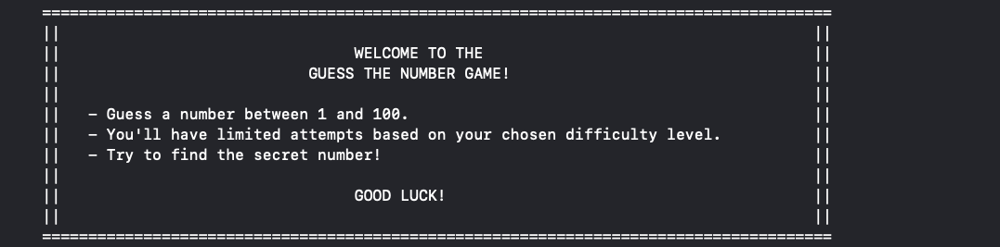
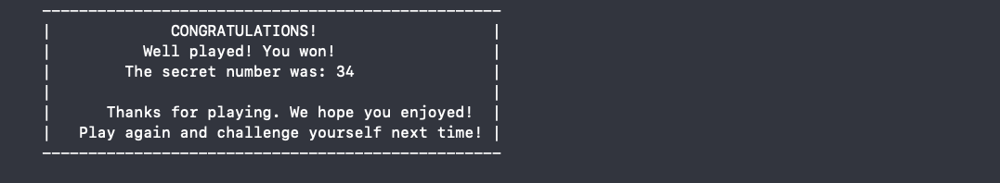

 # GuessTheNumberGame

 Console-based Application.

 This project was created as part of the 2025 Kian Academy Fundamental Course Level 0 (C++).
 It is a simple yet engaging console-based number guessing game where players attempt to find an unknown number within a limited number of tries, depending on the chosen difficulty level (Easy, Medium, or Difficult). 
 The project illustrates some of the basic principles of programming logic, conditional statements, loops, handling user input, and basic algorithm design. 
 It provided practical exposure to programming fundamentals and allowed for real-world application of what was taught in class. The project also developed problem-solving skills, user interface design, and structured coding standards at a beginner programmer level.

 ## Project Details

 ### 1# Main Page (Welcome Message)
 A visually appealing welcome message is displayed at the start of the program, introducing the game and its rules.

 ### 2# User Choice
 The user is prompted to enter 1 to play the game or 0 to exit. If the user enters 0, the program ends gracefully.
 

 ### 3# Difficulty Selection
 The user selects the difficulty level (1 for easy, 2 for medium, 3 for difficult). Based on the choice, the number of attempts is set:
    -Easy: 10 attempts
    -Medium: 7 attempts
    -Difficult: 5 attempts 

 ### 4# Guessing Loop 
 The user is prompted to enter their guess. After each guess, the program provides feedback:
    -If the guess is correct, the program displays a congratulatory message and ends.
    -If the guess is incorrect, the program tells the user whether the secret number is higher or lower and decrements the remaining attempts.

 ### 5# Game Over 
 If the user runs out of attempts, a "Game Over" message is displayed, revealing the secret number and encouraging the user to try again.
 

 ### 6# Crongratulations
 If the user get the secret number right,a "Crongratulations" message is displayed, revealing the secret number again and encouraging the user to try again.

 ### 7# THE END :)

 ---
 Thank you for caring 

 
